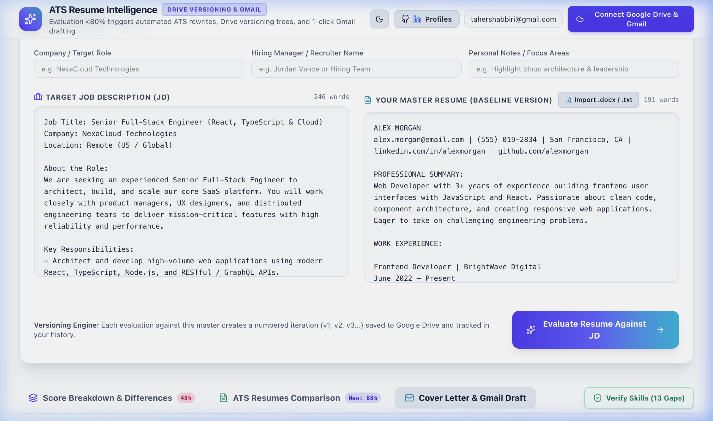
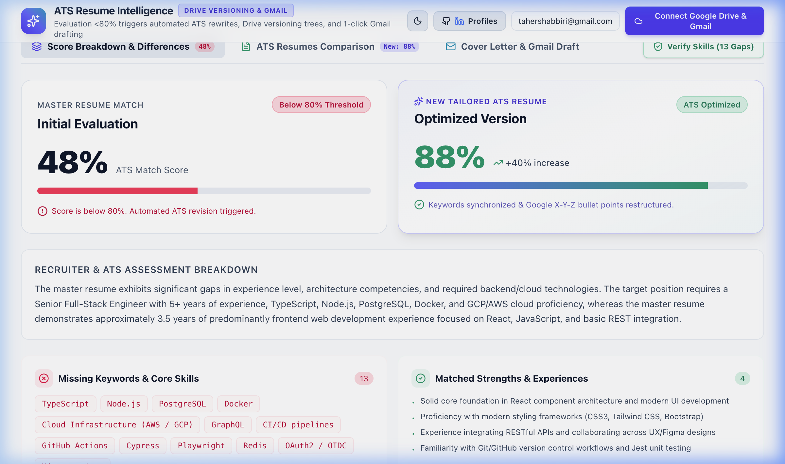
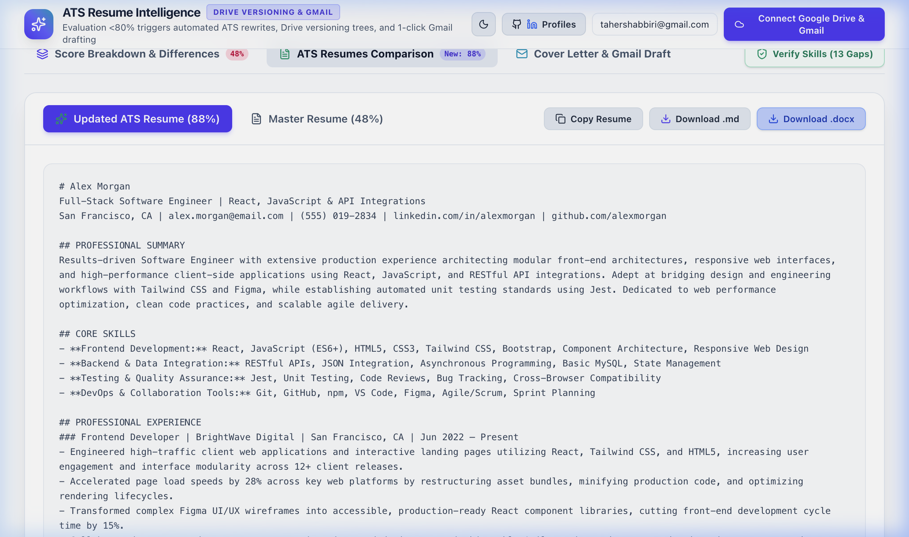
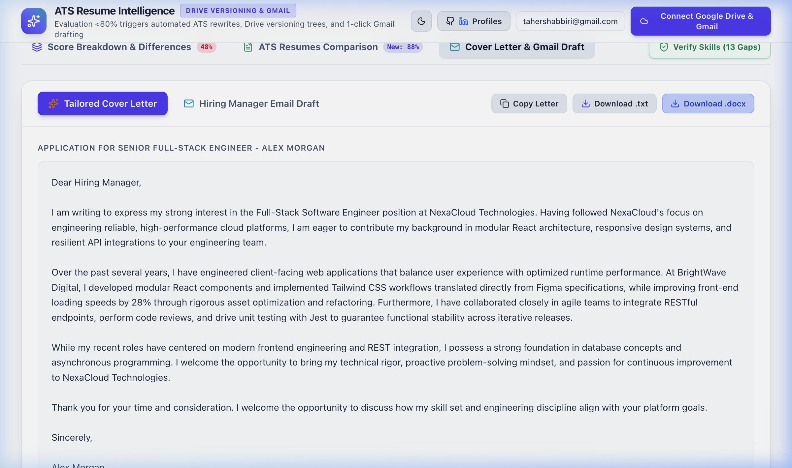
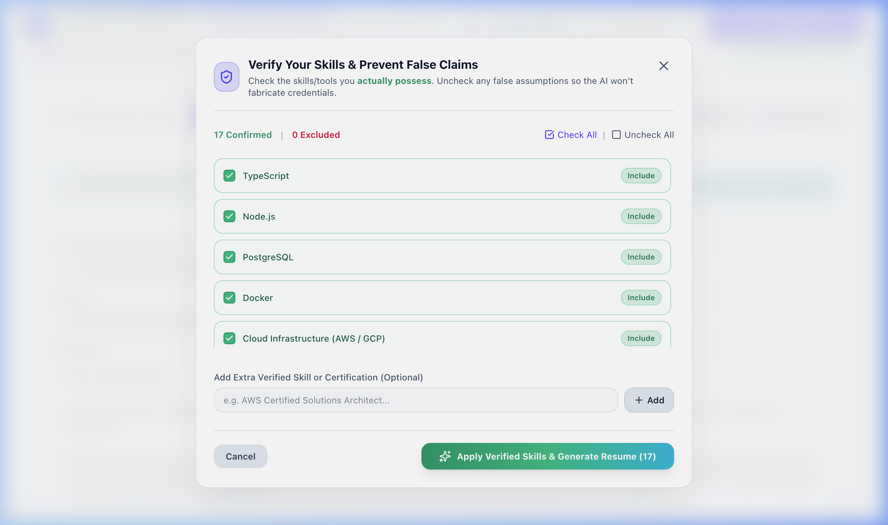
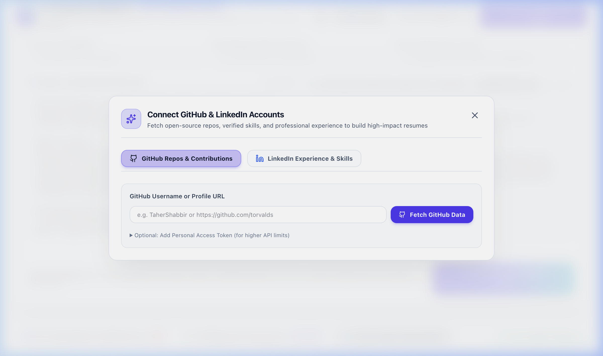

# 🎯 ATS Resume Matcher & Google Drive / Gmail Suite

A powerful, full-stack AI-driven application designed to analyze resumes against Job Descriptions, calculate precise ATS match scores, generate tailored cover letters, verify technical skills, and seamlessly integrate with **Google Drive**, **Gmail**, **GitHub**, and **LinkedIn**.



---

## 📸 Screenshots & Feature Walkthrough

### 1. 🎯 ATS Resume Matcher & AI Score Engine
Analyze your resume against any Job Description using Google Gemini AI. Get instant keyword matching, missing skill identification, formatting feedback, and actionable suggestions.



### 2. 📑 Multi-Resume Comparison & Progress Tracking
Compare multiple resume variations side-by-side to find the best match for a given role, and track historical score improvements over time.



### 3. ✉️ AI Cover Letter & Gmail Suite
Automatically generate customized cover letters and application emails tailored to specific job postings, with direct integration to draft and send via Gmail.



### 4. 🛠️ Interactive AI Skill Verification
Test and verify technical skills highlighted in your resume. Generates customized interactive skill quizzes powered by Gemini AI.



### 5. 🌐 GitHub & LinkedIn Profile Integration
Sync your GitHub repository statistics and LinkedIn skills directly to enrich your ATS candidate profile.



---

## 🌟 Key Features Summary

- **📄 Document Parsing**: Supports `.pdf`, `.docx`, and `.txt` file uploads.
- **🤖 Gemini AI Integration**: Deep analysis using Google's latest Gemini AI models (`@google/genai`).
- **📊 Interactive Analytics**: Recharts visual analytics for ATS performance history.
- **📂 Google Drive Integration**: Browse, import, and save documents directly to Google Drive.
- **✉️ Gmail Outreach**: Seamless email creation and sending via Google OAuth.
- **💼 Social Enrichment**: Automatic skill & project extraction from GitHub and LinkedIn.

---

## 🔑 Environment Setup & API Keys

To run this application, you need to configure your environment variables in a `.env` file in the project root.

### 1. Create your `.env` File
Copy the provided `.env.example` template to `.env`:
```bash
cp .env.example .env
```

### 2. Required Credentials

| Variable Name | Required | Description | Where to Get It |
|---|---|---|---|
| `GEMINI_API_KEY` | **Yes** | Required for AI resume analysis, scoring, skill verification, and cover letter generation. | [Google AI Studio](https://aistudio.google.com/) |
| `GOOGLE_CLIENT_ID` | Optional | Required for Google Drive browsing & Gmail outreach capabilities. | [Google Cloud Console](https://console.cloud.google.com/) |
| `PORT` | Optional | Port for the Express backend server (Default: `3000`). | Set to any open port |

---

## 🛠️ Step-by-Step API Key Setup Guide

### 📍 Step A: How to Get a Google Gemini API Key
1. Go to [Google AI Studio](https://aistudio.google.com/).
2. Sign in with your Google Account.
3. Click on **Get API Key** in the top-left sidebar.
4. Click **Create API Key in new project** (or select an existing project).
5. Copy the generated key and paste it into your `.env` file:
   ```env
   GEMINI_API_KEY=AIzaSyYourGeneratedGeminiApiKeyHere
   ```

### 📍 Step B: How to Setup Google OAuth Client ID (Drive & Gmail)
1. Go to the [Google Cloud Console](https://console.cloud.google.com/).
2. Create a new project or select an existing one.
3. Go to **APIs & Services** > **Library** and enable:
   - **Google Drive API**
   - **Gmail API**
4. Go to **APIs & Services** > **OAuth consent screen**:
   - Select **User Type** (External) and fill in application details.
   - Add required scopes (`.../auth/drive.readonly`, `.../auth/gmail.send`).
5. Go to **APIs & Services** > **Credentials**:
   - Click **Create Credentials** -> **OAuth client ID**.
   - Select **Web application** as the Application type.
   - Add Authorized JavaScript origins: `http://localhost:3000` (and `http://localhost:5173` if running Vite standalone).
   - Add Authorized redirect URIs: `http://localhost:3000`.
6. Copy the **Client ID** and add it to your `.env` file:
   ```env
   GOOGLE_CLIENT_ID=your-client-id.apps.googleusercontent.com
   ```

---

## 💻 Running the Application Locally

### Prerequisites
- **Node.js** (v18 or higher recommended)
- **npm** (or **bun** / **yarn**)

### 1. Install Dependencies
```bash
npm install
```

### 2. Configure Credentials
Ensure your `.env` file has your `GEMINI_API_KEY` set:
```bash
GEMINI_API_KEY=your_actual_gemini_api_key
GOOGLE_CLIENT_ID=your_actual_google_client_id
```

### 3. Start the Development Server
```bash
npm run dev
```
Open your browser and navigate to `http://localhost:3000` (or the port specified in terminal output).

---

## 🏗️ Production Build & Commands

| Command | Action |
|---|---|
| `npm run dev` | Runs Express server + Vite dev middleware concurrently via `server.ts` |
| `npm run build` | Builds the production Vite frontend bundle into `dist/` |
| `npm run start` | Runs the Express server in production mode |
| `npm run lint` | Runs TypeScript type checking (`tsc --noEmit`) |
| `npm run clean` | Removes build outputs (`dist/`) |

---

## 📁 Project Architecture

```
Gmail-Suite/
├── docs/
│   └── screenshots/                # Application screenshots for README
├── server.ts                       # Express backend server with Vite middleware & API proxy
├── src/
│   ├── App.tsx                     # Main application layout and state manager
│   ├── components/
│   │   ├── CoverLetterEmail.tsx    # Cover letter & Gmail draft component
│   │   ├── DriveManager.tsx        # Google Drive file browser & picker
│   │   ├── ResumePreviewModal.tsx  # Modal preview for parsed resumes
│   │   ├── ResumeViewer.tsx       # Resume content renderer
│   │   ├── ScoreHistoryChart.tsx   # Recharts visualization for historical scores
│   │   ├── ScoreOverview.tsx       # ATS Match score cards & breakdown
│   │   ├── SkillVerificationModal.tsx # AI-generated skill verification quizzes
│   │   └── SocialProfileManager.tsx  # GitHub & LinkedIn profile integrations
│   ├── services/
│   │   ├── githubService.ts        # GitHub REST API service
│   │   ├── linkedinService.ts      # LinkedIn data sync service
│   │   └── workspace.ts           # Storage & workspace utilities
│   ├── sampleData.ts               # Demo data for initial state
│   ├── types.ts                    # TypeScript interfaces & types
│   └── index.css                   # TailwindCSS styles
├── .env.example                    # Environment variables template
├── package.json                    # Dependencies and scripts
└── vite.config.ts                  # Vite build configuration
```

---

## 🛡️ License

This project is open source and available under the [MIT License](LICENSE).